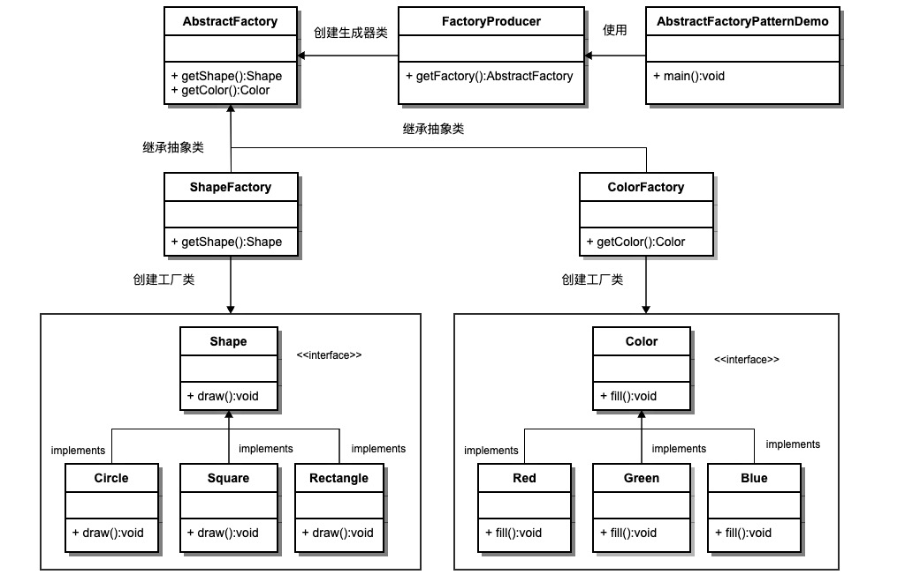

##抽象工厂模式

抽象工厂模式（Abstract Factory Pattern）是围绕一个超级工厂。该超级工厂又称为其他工厂的工厂。 
此模式属于设计模式的创建型模式，他提供了一种创建对象的最佳方式。 
在抽象工厂模式中，接口负责创建一个相关对象的工厂，不需要显式指定他们的类。每个生成的工厂都能按照工厂模式提供对象。

###介绍
1、<b>意图：</b>提供一个创建一系列相关或相互依赖对象的接口，而无需指定他们的类。 
2、<b>主要解决：</b>接口选择的问题。 
3、<b>何时使用：</b>系统的产品有多于一个的产品族，而系统只消费某一族的产品。 
4、<b>如何解决：</b>在一个产品族里面，定义多个产品。 
5、<b>关键代码：</b>在一个工厂内聚合多个同类产品。 
6、<b>优点：</b>当一个产品族中的多个对象被设计成一起工作时，它能保证客户端始终只使用同一产品族中的对象。 
7、<b>缺点：</b>产品族扩展非常困难。 
8、<b>使用场景：</b>
<li>1、请求换皮肤，一整套一起换</li>
<li>2、生成不同操作系统的程序</li>

###实现
我们将创建Shape和Color接口和实现这些接口的实体类。 
1、创建抽象工厂类AbstractFactory。 
2、接着定义工厂类ShapeFactory和ColorFactory，这两个工厂类都是扩展了AbstractFactory。 
3、然后创建一个工厂创造器/生成器类FactoryProducer。
4、AbstractFactoryPatternDemo类使用FactoryProducer来获取AbstractFactory对象。
它将向AbstractFactory传递形状信息Shape(CLE/RECTANGLE/SQUARE),，以便获取它所需对象的类型。
同时还向AbstractFactory传递颜色信息Color(RED/GREEN/BLUE)，以便获取它所需对象的类型。  

###图解

